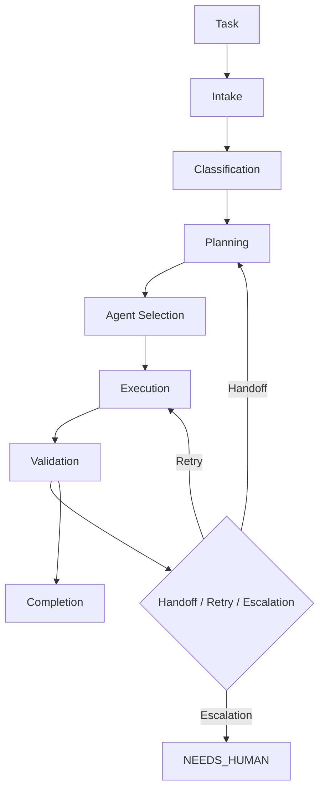

# Arquitectura del Sistema Multiagente

## 1. Modelo de capas

La arquitectura se organiza en **tres capas** que materializan la separación de preocupaciones (véase ADR-002, ADR-011, ADR-012). OpenCode es el runtime de ejecución; el framework define comportamiento, contratos y políticas.

```text
┌──────────────────────────────────────────────────────────────┐
│ AGENT LAYER                                                   │
│                                                              │
│  analyst · architect · researcher · developer                │
│  tester · reviewer · [security]*                             │
│                                                              │
│  * security solo si security_sensitive == true (ADR-003)     │
├──────────────────────────────────────────────────────────────┤
│ INTELLIGENCE & CONTEXT LAYER                                 │
│                                                              │
│  memoria (Working → … → Audit)  ·  decisiones (ADR)          │
│  conocimiento técnico  ·  contexto de tarea                  │
│  [Gentle-AI — opcional, vía adaptador (ADR-011)]             │
├──────────────────────────────────────────────────────────────┤
│ EXECUTION LAYER (OpenCode runtime)                           │
│                                                              │
│  agentes · herramientas · permisos · comandos ·              │
│  runtime del framework (orchestrator como mecanismo)         │
└──────────────────────────────────────────────────────────────┘
```

| Capa | Contenido | Responsabilidad |
|------|-----------|-----------------|
| Agent | Roles especializados del roster (ADR-003) | Ejecutar funciones especializadas dentro de sus permisos |
| Intelligence & Context | Memoria, decisiones, conocimiento, contexto de tarea | Proveer contexto e inteligencia sin ejecutar acciones |
| Execution | OpenCode + herramientas + permisos + runtime | Ejecutar acciones sobre el proyecto |

La capa de ejecución nunca depende de un modelo concreto ni de Gentle-AI; su ausencia degrada sin romper el ciclo completo (véase ADR-011).

> **Regla**: el framework define comportamiento, contratos y políticas; OpenCode ejecuta. Nada de la capa de ejecución queda fuera de la herramienta.

## 2. Orchestrator: mecanismo de control, no agente

El Orchestrator es el **controlador de flujo** del framework (véase ADR-002). No compite con los agentes especializados: **coordina, no ejecuta**. En OpenCode se materializa como el agente principal de configuración y los comandos del framework.

Componentes del runtime que lo implementan:

| Componente | Responsabilidad |
|------------|-----------------|
| Task manager | Ingesta, clasificación, prioridad y seguimiento del estado de tareas |
| Workflow engine | Interpreta y ejecuta workflows declarativos YAML (sección 4) |
| Agent resolver | Selecciona el agente por tipo de tarea y capacidades (véase ADR-003) |
| Permission gate | Aplica la cadena AGENT→CAPABILITY→TOOL→PERMISSION→RESOURCE→ACTION (véase ADR-009) |
| Execution manager | Ciclo de vida de ejecuciones, límites y checkpoints |
| Retry manager | Política de reintentos con clasificación obligatoria (véase ADR-005) |
| Quality gate manager | Evalúa gates G1-G6 y R1-R4 (véase ADR-006) |
| Approval manager | Gestiona el contrato de aprobación humana (véase ADR-010) |
| Event dispatcher | Emite eventos tipados para logs, métricas, audit y memoria (véase ADR-014) |

La lógica de coordinación vive en estos componentes del runtime: es testeable y no depende de un modelo (véase ADR-002).

> **Regla**: el Orchestrator coordina y controla; no compite con los roles especializados.

## 3. Flujo maestro

Flujo canónico de una tarea, de la solicitud a la finalización:



| Etapa | Responsable (runtime) | Salida |
|-------|------------------------|--------|
| Task | Ingesta | Tarea con id, prioridad y metadatos |
| Intake | Task manager | Tarea registrada, evento `TaskCreated` |
| Classification | Task manager | Tipo de tarea + `security_sensitive` (véase ADR-003) |
| Planning | Workflow engine + architect | Workflow con steps y dependencias |
| Agent Selection | Agent resolver | Agente(s) por capacidades del roster (véase ADR-003) |
| Execution | Execution manager | Artefactos + tool calls registradas |
| Validation | Quality gate manager | Gates G1-G6 según tipo de tarea (véase ADR-006) |
| Handoff / Retry / Escalation | Retry manager + approval manager | Siguiente paso según ADR-004, ADR-005, ADR-010 |
| Completion | Task manager | `DONE`, artefactos y eventos finales |

> **Regla**: cada etapa produce un estado y artefactos verificables; ninguna etapa se omite sin una ADR o una aprobación humana registrada.

## 4. Workflow engine

Los workflows son **datos declarativos versionados**, no lógica embebida en prompts (véase ADR-002). Esquema YAML:

```yaml
workflow:
  id: feature-development
  version: "1.0"
  steps:
    - id: analyze
      agent: analyst
      input:
        source: task.requirements
      depends_on: []
      condition: "true"
      retry_policy:
        max_attempts: 3
        backoff: exponential
      timeout:
        seconds: 120
      quality_gates: [G1]
    - id: design
      agent: architect
      depends_on: [analyze]
      quality_gates: [G1]
    - id: implement
      agent: developer
      depends_on: [design]
      quality_gates: [G2, G4]
    - id: security
      agent: security
      condition: "security_sensitive == true"      # véase ADR-003
      depends_on: [implement]
      quality_gates: [G5]
    - id: test
      agent: tester
      depends_on: [implement]
      quality_gates: [G3]
    - id: review
      agent: reviewer
      depends_on: [test]
      quality_gates: [G6]
```

| Campo del step | Tipo | Descripción |
|----------------|------|-------------|
| `id` | string | Identificador único del step |
| `agent` | string | Agente del roster que lo ejecuta (véase ADR-003) |
| `input` | mapa | Entradas: tarea, artefactos, contexto relevante |
| `depends_on` | lista | Dependencias; un step no se ejecuta hasta que estén satisfechas |
| `condition` | expresión | Ejecución condicional (ej. `security_sensitive == true`) |
| `retry_policy` | mapa | `max_attempts` (default 3) y backoff (véase ADR-005, ADR-007) |
| `timeout` | mapa | Límite temporal por paso (default p95 < 120s; véase ADR-007) |
| `quality_gates` | lista | Gates G1-G6 aplicables a ese paso (véase ADR-006) |

Condicional y paralelismo:

```text
si security_sensitive == true  →  step security (ADR-003)

   developer
      ├──→ tester        # sin dependencias mutuas: paralelo
      └──→ security      # solo si la condición se cumple
```

El MVP mantiene paralelización conservadora y explícita (véase `docs/13-orchestration/workflow-engine.md`).

> **Regla**: un workflow es datos versionados que el engine interpreta; cada step emite eventos y registra su estado por separado.

## 5. Máquina de estados en tres capas (véase ADR-004)

Tres vocabularios de estado, un solo mapeo formal.

**Capa 1 — Estados de tarea (canónico, dominio):**

```text
BACKLOG → ANALYZING → PLANNING → READY → IMPLEMENTING → TESTING → REVIEWING → APPROVED → DONE
```

Excepcionales: `BLOCKED`, `FAILED`, `NEEDS_HUMAN`, `CANCELLED`.
Transiciones válidas: la cadena anterior, `TESTING → IMPLEMENTING`, `REVIEWING → IMPLEMENTING`, y desde cualquier estado excepcional hacia el estado del workflow que corresponda.

**Capa 2 — Estados de ejecución (runtime):**

```text
created → queued → running → waiting → blocked → failed → completed → cancelled
```

**Capa 3 — Status de salida del agente:**

```text
completed | failed | blocked | needs_human | partial
```

**Mapeo formal:**

| Salida del agente | Estado de tarea resultante |
|-------------------|----------------------------|
| `completed` | Avanza al siguiente estado del pipeline |
| `failed` | `FAILED` (con reporte de fallo) o retry → estado anterior |
| `blocked` | `BLOCKED` (con razón y dependencia) |
| `needs_human` | `NEEDS_HUMAN` / `WAITING_APPROVAL` (aprobación humana) |
| `partial` | Vuelve al estado anterior con entrega parcial documentada |

> **Regla**: un cambio de estado solo ocurre por transición válida; los checkpoints y eventos se derivan del estado, no del relato del agente.

## 6. Pipeline de ejecución

La unidad de ejecución sigue este pipeline en el runtime:

```text
Resolve Agent → Build Context → Permission Check → Start → Run
→ Collect Tool Calls → Validate Output → Quality Gate → Persist State → Next Step
```

| Etapa | Qué hace | Notas |
|-------|----------|-------|
| Resolve Agent | Selecciona el agente por tarea y capacidades | Agent resolver (véase ADR-003) |
| Build Context | Construye el `AgentInput` mínimo | No se entrega toda la información disponible; task + requirements + contexto relevante + memoria recuperada + output previo (véase ADR-008) |
| Permission Check | Verifica permiso por recurso y acción | Se aplica en **cada** tool call, no solo al inicio (véase ADR-009) |
| Start | Abre la ejecución y emite evento | `execution_id`, límites (turns, tool calls, tiempo, costo; véase ADR-007) |
| Run | Ejecuta el agente | Agente como unidad controlada, observable y recuperable |
| Collect Tool Calls | Captura cada `tool_call`/`tool_result` | Con provenance (véase ADR-013) |
| Validate Output | Valida contra el contrato `AgentOutput` | Status: `completed/failed/blocked/needs_human/partial` (véase ADR-004) |
| Quality Gate | Aplica los gates de tarea | G1-G6 según tipo de tarea (véase ADR-006) |
| Persist State | Actualiza el estado en las tres capas | Eventos tipados para logs y memoria (véase ADR-004, ADR-014) |
| Next Step | Avanza el workflow o decide handoff/retry/escalación | (véase ADR-005, ADR-010) |

En caso de error durante `Run`:

```text
Run → failed → clasificación del fallo → retry (si reintentable) / replan / escalación (ADR-005)
```

> **Regla**: el pipeline es la única vía de ejecución; herramientas y gates se interponen en el runtime, nunca se delegan al prompt.

## 7. Contratos y artefactos (véase ADR-013)

Contratos base de la capa de comunicación (véase `docs/11-foundation/contracts.md`):

| Contrato | Descripción |
|----------|-------------|
| `Task` | Tarea con id, tipo, prioridad y estado |
| `AgentInput` | Entrada mínima del agente: `execution_id, task_id, agent_id, objective, context, constraints, artifacts` |
| `AgentOutput` | Salida del agente: `execution_id, agent_id, status, summary, artifacts, findings, errors, next_action` |
| `Handoff` | Transferencia entre agentes: `source, target, task_id, reason, context, artifacts, expected_output` |
| `ToolCall` / `ToolResult` | Invocación y resultado de herramienta con `tool_call_id, status, output, error, duration_ms` |
| `Execution` | Unidad de ejecución: `id, task_id, workflow_id, started_at, completed_at, status` |
| `Artifact` | Objeto verificable con `provenance` |
| `Event` | Suceso tipado con correlación |
| `QualityGate` | Resultado de un gate |
| `Workflow` | Definición declarativa de pasos |
| `MemoryRecord` | Registro de memoria |

Reglas: versionar contratos; validar inputs; normalizar outputs; registrar provenance (`execution_id, agent_id, created_at, checksum`); evitar campos ambiguos. Ningún handoff ni decisión depende exclusivamente de contexto conversacional oculto; las decisiones arquitectónicas persisten como ADR.

> **Regla**: nada importante se comunica solo por chat; todo se persiste como artefacto con provenance.

## 8. Observabilidad y correlación (véase ADR-014)

Cadena de correlación única para cualquier ejecución:

```text
request_id → task_id → execution_id → step_id → agent_id → tool_call_id   (+ trace_id)
```

- Eventos tipados y versionados alimentan logs, métricas, auditoría y evaluación.
- Audit **append-only e inmutable**: `actor, action, resource, decision, timestamp, reason, execution_id`.
- **Nunca** se registran contraseñas, API keys, tokens o claves privadas; redacción antes de persistir.

> **Regla**: cualquier ejecución es reconstruible por su cadena de correlación; los secretos nunca se persisten.

## 9. Decisiones de v0 resueltas

Los aspectos que la especificación original dejaba abiertos quedaron cerrados por los ADR de v0
(véanse ADR-020, ADR-021 y ADR-022):

| Pendiente original | ADR resolutorio |
|--------------------|-----------------|
| Matriz de gates de tarea por tipo de tarea (G1-G6) | ADR-021 (taxonomía canónica de 9 tipos; la matriz G1-G6 se expresa sobre ella) |
| `max_cost` por tipo de tarea | ADR-020 (valores por tipo de tarea, configurables) |
| Niveles concretos de paralelización del workflow engine | ADR-021 (`max_concurrent_agents: 4` por defecto; paralelismo solo para tareas independientes) |
| Esquema de persistencia de checkpoints y estado de ejecución | ADR-021 (backend JSON por tarea en `runtime/checkpoints/`, git-ignored) |
| Capacidades verificadas del adaptador Gentle-AI | ADR-022 (routing de modelos, gestión de agentes, evaluación; véase ADR-011) |

## 10. Regla final

La arquitectura se materializa como **configuración versionada de OpenCode** (`opencode.json` + `AGENTS.md` + agentes `.md` + comandos) derivada de los ADR sin reinterpretación (véase ADR-012). Cualquier extensión de comportamiento es una ADR nueva, nunca una edición silenciosa.

> **Regla**: primero un sistema pequeño que funcione correctamente; después, autonomía (cita normativa de `docs/09-implementation/implementation-overview.md`).
